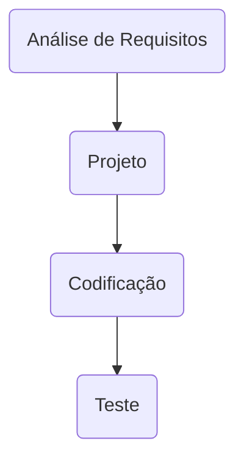

# SIG - para Vendas e Suprimentos

## Processo de Desenvolvimento de Software
> O PDS segue uma abordagem interativa incremental. Cada atividade da interação tem uma definição de pronto estabelecida com objetivo de controlar a qualidade. 

> Definição de pronto estabelecida para cada fase

| Fase | Critério de aceitação - como a qualidade será atingida |
| ------------ | ------------------------------------------------------------------------ |
| Análise de Requisitos | Esta fase será considerada concluída quando for realizada a reunião entre a equipe de desenvolvimento e o cliente para estabelecer o “de acordo” no documento de requisitos. Os requisitos serão documentados utilizando "estorias de usuário". Os requisitos serão priorizados de acordo com a criticidade para o negócio e a probabilidade de falhas. Exemplos de uso da aplicação servem como base na especificação dos casos de teste. |
| Projeto | Esta atividade será considerada concluída quando a análise de rastreabilidade entre o DER – Diagrama de Entidade e Relacionamentos e o documento de requisitos não identificarem inconsistências  |
| Codificação |Será considerada concluída quando a análise de rastreabilidade entre o código e as funções solicitadas no documento de requisitos não identificarem inconsistências   |
| Teste | Será considerada concluída quando 100% dos casos de teste prioritários (funções mais utilizadas, impacto da falha) rastreáveis para os requisitos obtiverem satisfatório   |

### Análise de Requisitos

> Cada requisito tem um identificador único de maneira que seja possível rastrear a necessidade do cliente com a implementação do software.

| Fase | Critério de aceitação - como a qualidade será atingida |
| ------------ | ------------------------------------------------------------------------ |
| REQ01 – cadastrar cliente | Como – vendedor, Eu quero – cadastrar o cliente, De maneira que – seja possível identificar o cliente e o endereço de entrega |
| REQ02 – consultar cliente | Como – vendedor, Eu quero – consultar um cliente, De maneira que – seja possível obter informações detalhas do cliente |
| REQ03 – corrigir informações de cliente | Como – vendedor, Eu quero – corrigir as informações do cliente, De maneira que – seja possível manter as informações atualizadas |
| REQ04 – excluir cliente | Como – vendedor, Eu quero – excluir um cliente, De maneira que – seja possível manter informações somente de clientes ativos |

