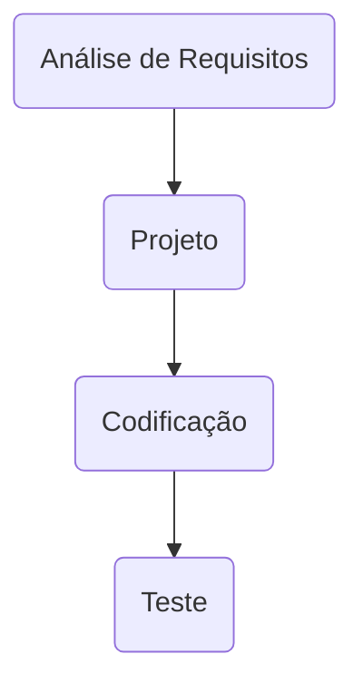

# SIG - para Vendas e Suprimentos

## Processo de Desenvolvimento de Software
> O PDS segue uma abordagem interativa incremental. Cada atividade da interação tem uma definição de pronto estabelecida com objetivo de controlar a qualidade. 

> Definição de pronto estabelecida para cada fase

| Fase | Critério de aceitação - como a qualidade será atingida |
| ------------ | ------------------------------------------------------------------------ |
| Análise de Requisitos |No inicio da interação a equipe se reune para garantir que existe um entendimento comum entre os envolvidos sobre o comportamento do software. Exemplos de uso são discutidos para validar o entedimento. Os requisitos serão documentados utilizando "estorias de usuário". Os requisitos serão priorizados de acordo com a complexidade para o desenvolvimento (funções mais complexas são mais sujeitas a falhas) e o perfil operacional de uso (funções mais utilizadas tem um impacto alto na falha). Exemplos de uso da aplicação servem como base na especificação dos casos de teste.  | 
| Projeto | Esta atividade será considerada concluída quando a análise de rastreabilidade entre o DER – Diagrama de Entidade e Relacionamentos e o documento de requisitos não identificarem inconsistências  |
| Codificação |Será considerada concluída quando a análise de rastreabilidade entre o código e as funções solicitadas no documento de requisitos não identificarem inconsistências   |
| Teste | Será considerada concluída quando 100% dos casos de teste prioritários (complexidade, funções mais utilizadas) rastreáveis para os requisitos obtiverem satisfatório   |
#### Estudo de Caso

> Considere que uma organização está iniciando um projeto para implantar um Sistema Integrado de Gestão de Vendas e Suprimentos. 
Os seguintes requisitos foram identificados na primeira reunião com o cliente (RU – Requisito de Usuário). 

- RU01 - Compras - Registra e acompanha os processos de compras na organização, prevê a entrega programada de pedidos de compra
- RU02 - Recebimento - Registra, controla e informa sobre a entrada de mercadorias e integra as informações dos dados da nota fiscal de entrada com o estoque 
- RU03 - Vendas – Registra e acompanha as vendas mantendo as informações integradas com o controle de estoque. 
- 
### Análise de Requisitos

> Cada requisito tem um identificador único de maneira que seja possível rastrear a necessidade do cliente com a implementação do software.

| Identificador | Descrição | Prioridade |
| ------------ | ------------------------------------------------------------------------ | ------| 
| REQ01 – cadastrar cliente | Como – vendedor, Eu quero – cadastrar o cliente, De maneira que – seja possível identificar o cliente e o endereço de entrega | Média |
| REQ02 – consultar cliente | Como – vendedor, Eu quero – consultar um cliente, De maneira que – seja possível obter informações detalhas do cliente | Alta |
| REQ03 – corrigir informações de cliente | Como – vendedor, Eu quero – corrigir as informações do cliente, De maneira que – seja possível manter as informações atualizadas | Baixa |
| REQ04 – excluir cliente | Como – vendedor, Eu quero – excluir um cliente, De maneira que – seja possível manter informações somente de clientes ativos | Baixa |

### Análise do comportamento
> Exemplos de uso estabelecem o comportamento esperado da aplicação. Os casos de teste (CT) são rastreaveis para os requsiitos (REQ)

| Identificador | Cenário de uso |
| ------------ | ------------------------------------------------------------------------ |
| REQ01 – cadastrar cliente | Como – vendedor, Eu quero – cadastrar o cliente, De maneira que – seja possível identificar o cliente e o endereço de entrega | Média |
| REQ02 – consultar cliente por ID| Como – vendedor, Eu quero – consultar um cliente pelo ID, De maneira que – seja possível obter informações detalhas do cliente | Alta |
| REQ03 – consultar cliente por CPF | Como – vendedor, Eu quero – consultar um cliente, De maneira que – seja possível obter informações detalhas do cliente | Alta |
| REQ04 – consultar todos os clientes | Como – vendedor, Eu quero – consultar todos os clientes cadastrado, De maneira que – seja possível obter uma lista de clientes | Baixa |
| REQ05 – corrigir informações de cliente | Como – vendedor, Eu quero – corrigir as informações do cliente, De maneira que – seja possível manter as informações atualizadas | Baixa |
| REQ06 – excluir cliente | Como – vendedor, Eu quero – excluir um cliente, De maneira que – seja possível manter informações somente de clientes ativos | Baixa |

### Análise do comportamento
> Exemplos de uso estabelecem o comportamento esperado da aplicação. Os casos de teste (CT) são rastreaveis para os requsiitos (REQ). O elo de rastreabilidade é estabelecido pelo identificador do caso de teste.

| Identificador | Cenário de uso |
| ------------ | ------------------------------------------------------------------------ |
| REQ01CT01 | Dado (setup) que o CPF do cliente não está cadastrado; Quando (ação) o usuário confirma o cadastro; Então (resultado esperado) o sistema envia uma mensagem de cadastro realizado com sucesso |
| REQ01CT02 | Dado (setup) que o CPF do cliente está cadastrado; Quando (ação) o usuário confirma o cadastro; Então (resultado esperado) o sistema rejeita e envia uma mensagem de dados inválidos |

### Projeto

> O projeto de software é iniciado logo que os requisitos de software tenham sido analisados e modelados e prepara a equipe para a transição entre a análise e o código. O projeto arquitetural define os relacionamentos entre os principais elementos estruturais do software (PRESSMAN, 6ed. p. 187). O projeto arquitetural pode ser apresentando na forma de multiplas perpectivas. Krutchen (1995) sugere 4 visões: visão lógica, visão de implementação, visão de processo e visão de instalação. Adcionalmente as 4 visões existe os cenários que determinam a dinâmica e o comportamento da aplicação. Cada cenário descreve como os varios componentes arquiteturais colaboram para manipular uma operação de sistema. 

Para atender as necessidades de manutenibilidade e faciliar o uso por dispositivos moveis, tablets e desktops a arquitura de software segue o estilo Hezagonal (RICHARDSON, 2018, p.38)utilizando uma abordagem de desenvolvimento de software orientada a serviços.

Os serviços foram classificados em três tipos (ERL, 2007): **1. Serviços utilitários**. Implementam funcionalidades comuns a vários tipos de aplicações, como, por exemplo: log, notificação, transformação de informações. Um exemplo de serviço utilitário é um serviço de conversão de moeda que poderá ser acessado para calcular a conversão de uma moeda (por exemplo, dólares) para outra (por exemplo, euros).
**2. Serviços de entidade (serviços de negócios)**. Derivado de uma ou mais entidades de negócio (domínio), possuindo um alto grau de reutilização. Geralmente são serviços que fazem operações CRUD (Create, Read, Update e Delete). **3. Serviços de tarefa (coordenação de processos-workflow)**. Tipo de serviço mais específico que possui baixo grau de reuso. Consome outros serviços para atender seus consumidores. São serviços que suportam um processo de negócios amplo que geralmente envolve atividades e atores diferentes. Um exemplo de serviço de coordenação em uma empresa é um serviço de pedidos em que os pedidos são feitos, os produtos são aceitos e os pagamentos são efetuados.

